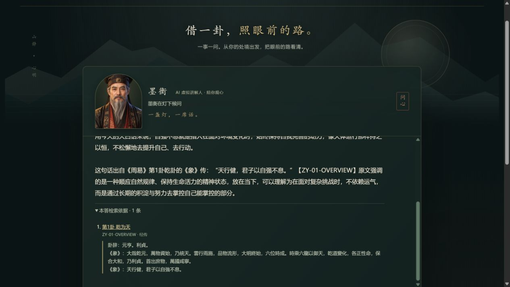
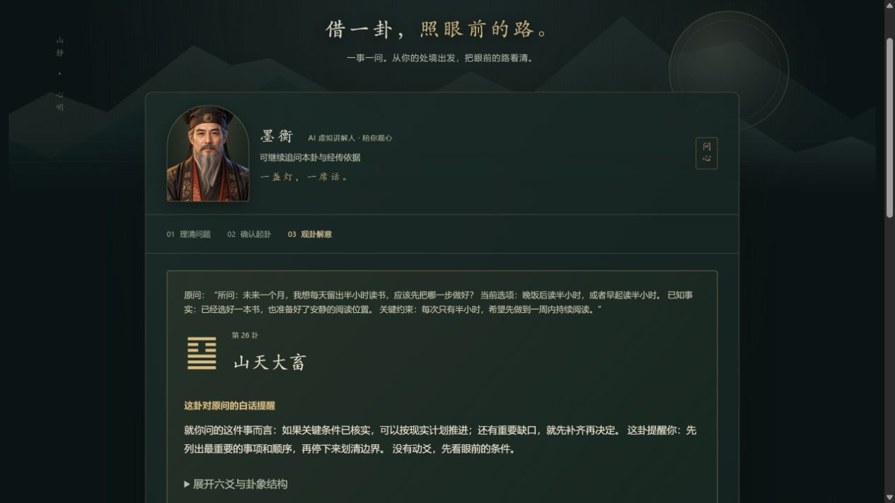
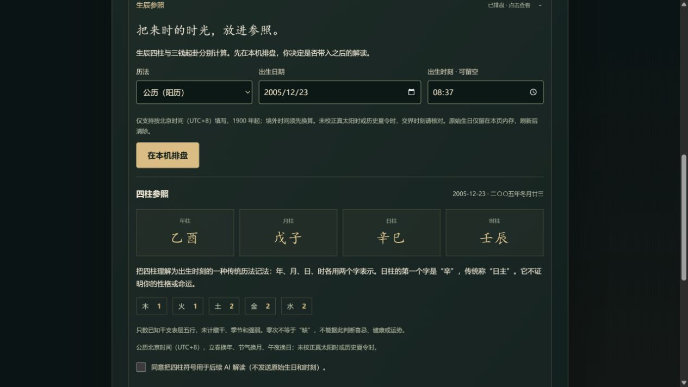
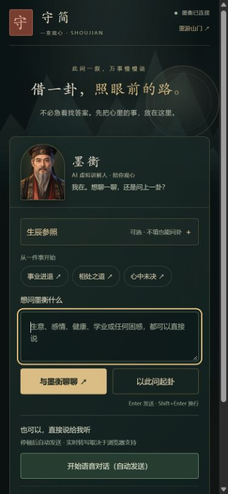
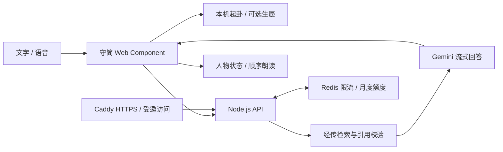

<div align="center">

# 守简 · 墨衡小卦

### 借一卦，照眼前的路。

一扇山门，一盏灯，一位愿意听你说话的 AI 讲解人。<br>
把中式意境、自然对话与有出处的《周易》解读，放进一个轻量网页。

[](https://github.com/dengjihui1/shoujian-oracle/actions/workflows/ci.yml)


[](LICENSE)

[**下载项目**](https://github.com/dengjihui1/shoujian-oracle/releases/tag/v0.57.1) · [界面一览](#界面一览) · [快速开始](#快速开始) · [设计与工程](#设计与工程) · [部署指南](docs/DEPLOYMENT.md)


**推门 · 问心**<br>
<sub>真实开场动画录制。支持跳过、键盘操作和减少动态效果。</sub>

</div>

---

## 界面一览

### 01 / 入境——先慢下来，再开始说

墨绿、旧金、远山与月色，构成一间安静的对话空间。墨衡以半身人物迎客，随倾听、思考、开口和照卦切换状态；主界面保留清楚的聊天与起卦入口。


### 02 / 问经——白话能读懂，原文有处查

直接聊天，也可以直接问《周易》。经传问题先检索冻结知识，再生成带证据编号的解释；展开回答下方的依据，就能看见原文与来源链接。



### 03 / 观卦——从一件具体的事出发

选择起卦后，先理清选项、事实和约束，确认摘要，再由程序掷三钱六次。结果先给白话提醒，六爻结构按需展开；可以继续追问这卦与原问的关系。



<table>
<tr>
<td width="65%" valign="top">

### 04 / 生辰——可选的历法参照

支持公历、农历与闰月；不清楚时刻可以留空。四柱在本机计算，生日与时刻仅留在本页内存；另行同意后，才将四柱符号带入后续 AI 解说。



这是基础四柱参照，当前不包含完整八字命理知识库。

### 05 / 随身——手机也能慢慢聊

同一套界面适配窄屏，保留清楚的输入、聊天与起卦按钮。语音按设备能力启用；识别不可用时，文字交流仍可继续。

</td>
<td width="35%" align="center" valign="top">

<br><sub>390px 手机仿真视口</sub>
</td>
</tr>
</table>

<sub>素材均来自实际运行的 0.57.1 页面，未拼造界面或模型回答。问答、读书计划与生日均为专用演示内容；手机截图不等同于真机验收。详见 [素材说明](assets/showcase/README.md)。</sub>

## 能做什么

| 能力 | 体验 |
| --- | --- |
| **自然对话** | SSE 流式回答、近期上下文、停止与重试；普通聊天不会强制进入起卦 |
| **经传有据** | 64 卦、384 爻、8 组取象，共 456 条冻结片段；引用校验与繁简检索 |
| **三钱六爻** | 情境访谈 → 摘要确认 → 随机排卦 → 白话解意；文字和生辰不控制随机结果 |
| **虚拟讲解人** | 写实素材、呼吸眨眼、倾听与回应动作；嘴部随实际播放状态变化 |
| **语音交流** | 浏览器增量识别与朗读；可另配 Google Cloud 流式 STT / 云端 TTS，支持打断 |
| **本机记忆** | 最近 24 条已完成对话可恢复、导入、导出或清除；生辰原始输入不随之保存 |

## 快速开始

需要 **Node.js 24+**。

```bash
git clone https://github.com/dengjihui1/shoujian-oracle.git
cd shoujian-oracle
npm ci
npm start
```

打开 [**http://127.0.0.1:8000/**](http://127.0.0.1:8000/)。

- **不配密钥**：可体验山门、人物、本机排卦和生辰参照；普通对话为有限本地响应。
- **开启 AI 对话**：复制 `.env.example` 为 `.env`，在本机填写 `GEMINI_API_KEY`，重启。详见 [API 配置](docs/API_SETUP.md)。
- **Google 实时识别**：需要独立 Cloud 项目、结算和凭证，按 [STT 指南](docs/GOOGLE_CLOUD_STT_SETUP.md) 配置。

密钥只放服务端环境文件。生产预算示例默认 `PAID_AUDIO_ENABLED=false`，关闭付费识别、录音兜底和云端朗读；浏览器语音仍取决于设备与网络。

## 设计与工程

原生 **Web Component + Shadow DOM** 前端、**Node.js** 服务端。历法使用 `lunar-javascript`，繁简检索使用 `opencc-js`，部署采用 **Caddy + Redis**。



- **本机计算**：三钱排卦不依赖模型，生辰模块点击时才加载。
- **出处可查**：原文保持原样，繁简转换只用于检索；缺少依据时不伪造出处。
- **语音与文字分开**：朗读失败或被打断，不占住下一轮输入。
- **费用控制**：输出与并发限制、Redis 月度额度、付费音频总开关；请求量限制不等于人民币硬封顶。
- **轻量人物**：浏览器动画与写实素材，不要求每轮调用视频生成服务。

深入阅读：[模块地图](docs/COMPONENT_MAP.md) · [模块池](docs/MODULE_POOL.md) · [语音与 RAG](docs/VOICE_RAG_ARCHITECTURE.md) · [Cactus 借鉴边界](docs/CACTUS_MODULE_EXTRACTION.md)

## 验证与部署

| 检查 | 已记录的结果 |
| --- | --- |
| Node 测试 | 0.57.1：**283 / 283 通过** |
| 本机浏览器回归 | Chromium / WebKit 桌面及手机仿真：129 通过、3 项平台跳过；生辰与语音开关补测 16 通过 |
| 固定 RAG 集 | recall@4 与负例精度均 100%；不代表所有真实提问 |
| 真实云端链路 | 普通回答、流式回答、经传出处与授权后的生辰术语解说已实测 |
| GitHub Actions | 单测、五组浏览器配置、RAG、依赖审计、Caddy、Redis 重启及容器检查；最新状态见页首 CI |

```bash
npm test
npm run test:e2e
npm run eval:rag
npm run check
```

浏览器测试首次运行前执行 `npx playwright install`。自动测试不调用付费模型；`smoke:voice-browser` 是另行启用的收费链路实测。

准备小规模受邀网站时，依次阅读：

1. [**人工上线清单**](docs/LAUNCH_CHECKLIST.md)：账号、域名、设备、账单及回滚验收。
2. [**300 元月预算方案**](docs/COST_PERFORMANCE_PLAN.md)：资源分配、默认模型与费用边界。
3. [**受邀部署指南**](docs/INVITE_DEPLOYMENT.md)：共享口令入口、Compose 和 Redis 验收。

真实手机、麦克风、生产域名和账单仍须按清单验收。[质量基线](docs/QUALITY_BASELINE.md) · [0.57.1 修复](docs/RELEASE_0.57.1.md) · [0.57.0 功能交付](docs/RELEASE_0.57.0.md)

## 数据与使用边界

对话记录保存在当前浏览器，服务端不建立持久用户档案。启用云服务后，主动提交的内容、近期上下文及明确授权的四柱符号会发送给配置的服务商；浏览器语音也可能使用其供应商在线服务。

项目用于传统文化体验与自我反思，不提供确定性命运预测，不替代医疗、法律、投资等专业判断。人物为 AI 讲解人；本项目没有收费、支付或个人账号系统。

## License & Credits

代码使用 [MIT](LICENSE)。经传知识包来源与适用 CC BY-SA 4.0 说明见 [知识包](knowledge/README.md) 和 [NOTICE](NOTICE.md)；历法及繁简转换依赖保留各自许可。

<div align="center">
<br>

<br><sub>一问一念，一念一明。</sub>
</div>
